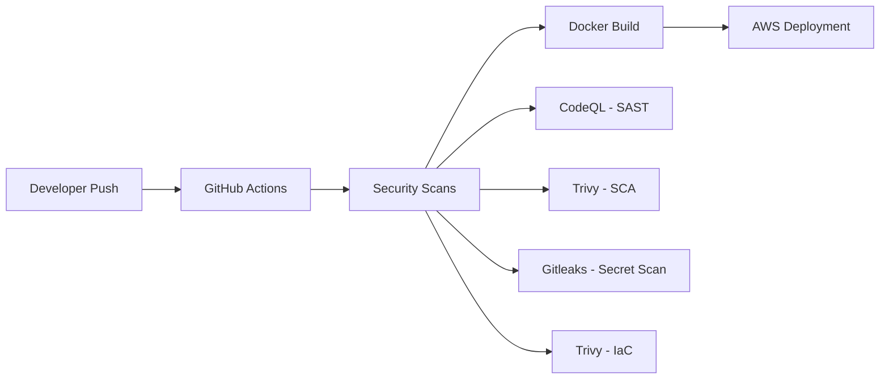
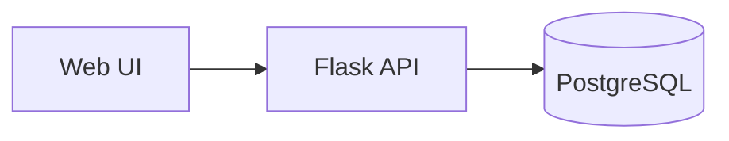

# DevSecOps Pipeline for NexusCore Technologies


## Project Overview

This repository demonstrates a production-ready DevSecOps pipeline built for **NexusCore Technologies**, a Series A fintech startup processing $2M in daily transactions. The pipeline implements automated security scanning at every stage of the development lifecycle.

### Business Context
- **Client**: NexusCore Technologies (Fintech - Payment Processing)
- **Challenge**: 3 security incidents in Q4, investors demanding improved security posture
- **Solution**: Shift-left security approach with automated scanning in CI/CD


---
## Security Outcomes

This pipeline enables NexusCore to:
- Detect vulnerabilities before deployment
- Prevent leaked secrets from entering source control
- Block builds containing high-severity CVEs
- Surface IaC misconfigurations early in the delivery lifecycle

---

## Security Tools Implemented

| Tool | Purpose | Stage |
|------|---------|-------|
| **CodeQL** | Static Application Security Testing (SAST) | Build |
| **Trivy** | Dependency & Container Scanning (SCA) | Build |
| **Gitleaks** | Secret Detection | Pre-commit |
| **Trivy IaC** | Infrastructure as Code Security | Build |

---


## Architecture



### Application Context (High Level)



---


## Tech Stack

**Languages:** Python  
**CI/CD:** GitHub Actions  
**Security Tools:** CodeQL, Trivy, Gitleaks  
**IaC:** Terraform (AWS)  
**Cloud:** AWS  
**Containers:** Docker  

---


## Security Findings

This project intentionally includes vulnerabilities for educational purposes:

### SAST Findings (CodeQL)
- SQL Injection in user lookup function
- Command Injection in ping endpoint
- Server-Side Template Injection (SSTI)

### SCA Findings (Trivy)
- CVE-2020-14343 in PyYAML 5.4.1 (Critical)
- Multiple vulnerabilities in Flask 2.0.1

### IaC Findings (Trivy)
- S3 bucket without encryption
- Security group with overly permissive rules

---


## Skills Demonstrated

- **CI/CD**: GitHub Actions workflow design
- **SAST**: CodeQL query configuration
- **SCA**: Trivy vulnerability scanning
- **Containers**: Docker security best practices
- **IaC**: Terraform with AWS
- **Secret Management**: Gitleaks configuration

---
## Pipeline Execution

No local setup required. The pipeline triggers automatically:

```bash
git clone https://github.com/SadaC-hub/DevSecOps-pipeline-project-1.git
git push

# The pipeline runs automatically on push
# View results in the Actions tab
``` 

## About This Project

Built as part of the **Cyber Agoge DevSecOps Bootcamp** – training the next generation of security engineers.

---

*Note: Vulnerabilities in this project are intentional for educational purposes. Never deploy this code to production.*

